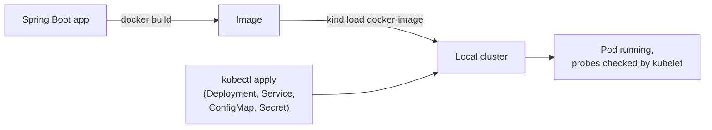
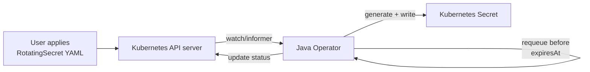

# Design: k8s-secret-rotation-operator

A guide to building a Java Kubernetes Operator that rotates Secrets on a schedule. Follow it top to bottom to build the project yourself, or read it as a reference for how the pieces fit together.

## 1. Overview

This project defines a custom Kubernetes resource, `RotatingSecret`, and a Java controller that watches it. On a schedule you set, the controller generates a new credential value, writes it into a native Kubernetes `Secret`, and updates the resource's status (`lastRotatedAt`, `expiresAt`, `rotationCount`). It re-queues itself to rotate again before the credential expires.

The goal is to learn Java and Kubernetes together instead of as two separate tracks. A REST service in a container teaches you Kubernetes the way most tutorials do, but it stops short of the operator pattern, which is what makes Kubernetes programmable rather than just a place to run containers. Manual credential rotation is a common source of outages and security gaps in real systems; this project rebuilds that kind of automation as a proper Kubernetes controller instead of an internal script.

The project has two stages. Stage 1 is a plain Java/Spring Boot service, deployed to Kubernetes by hand, to learn the core objects (Deployment, Service, ConfigMap, Secret, probes) before any operator code exists. Stage 2 replaces the manual deployment with a real operator that manages `RotatingSecret` resources.

By the end, you'll have: an operator running in a local cluster, rotating secrets on schedule, exposing Prometheus metrics, installable via a Helm chart, and built by a GitHub Actions pipeline.

## 2. Prerequisites

Everything here is free and runs locally. No cloud account or billing is required.

| Tool             | Version  | Purpose                                                           |
| ---------------- | -------- | ----------------------------------------------------------------- |
| Java             | 21 (LTS) | Language runtime. Install via`mise` or SDKMAN.                    |
| Maven            | 3.9+     | Build tool. Java Operator SDK ships a Maven quickstart archetype. |
| Docker           | latest   | Builds container images; backs kind/minikube.                     |
| kind or minikube | latest   | Runs a real local Kubernetes cluster.                             |
| kubectl          | latest   | Talk to the cluster.                                              |
| Helm             | 3.x      | Package and install the operator.                                 |
| gh (GitHub CLI)  | latest   | Already installed and authenticated as`afan104`.                  |

IDE: IntelliJ IDEA (Community Edition is free) is recommended over VS Code for this project, its Java and Spring Boot support is more complete. Not required, just easier.

No cloud registry is needed. Images built locally get loaded straight into the cluster with `kind load docker-image` (or `minikube`'s built-in Docker daemon via `eval $(minikube docker-env)`), so nothing is pushed anywhere during development.

## 3. Architecture

**Stage 1** has no operator. You build the app, load the image into the cluster, and apply four hand-written manifests: `Deployment`, `Service`, `ConfigMap`, and `Secret`. All of it, including the `Secret`, is static infrastructure you write and apply yourself. Kubernetes runs it and checks its health; nothing watches or reacts on its own. If the credential in the `Secret` needed to change, you'd have to generate a new value and reapply the file by hand.



**Stage 2** keeps the `Deployment`, `Service`, and `ConfigMap` from Stage 1 unchanged, they're still static infrastructure you write once. Only the `Secret` manifest is replaced: instead of hand-writing the credential, you write a small `RotatingSecret` manifest that states intent (which secret, how often to rotate it) and apply it once. A `CustomResourceDefinition` teaches the Kubernetes API server about this new `RotatingSecret` type. The operator is a Java process (running as its own Deployment) that watches for `RotatingSecret` objects and reconciles them: on create, update, or a scheduled requeue, it generates the credential and writes it into a real `Secret` object, the same kind of object as Stage 1, so the app reads it the exact same way. The difference is that no one has to reapply it by hand again.



The operator itself is a normal Kubernetes workload, just one with elevated RBAC permissions to read `RotatingSecret` resources and write `Secret` resources. It doesn't require anything Kubernetes doesn't already support; the CRD and the Java Operator SDK's reconciliation framework do the rest.

## 4. The `RotatingSecret` resource

A `RotatingSecret` has two parts: `spec`, which you write and the operator reads, and `status`, which the operator writes and you read. Never edit `status` by hand, the operator overwrites it every reconcile.

**Spec fields:**

| Field                     | Type   | Meaning                                                      |
| ------------------------- | ------ | ------------------------------------------------------------ |
| `secretName`              | string | Name of the`Secret` object the operator creates and updates. |
| `rotationIntervalSeconds` | int    | How often to generate a new credential.                      |
| `length`                  | int    | Length of the generated credential (default 32).             |

**Status fields:**

| Field           | Type      | Meaning                                                                            |
| --------------- | --------- | ---------------------------------------------------------------------------------- |
| `lastRotatedAt` | timestamp | When the credential was last generated.                                            |
| `expiresAt`     | timestamp | `lastRotatedAt` + `rotationIntervalSeconds`. The operator requeues before this.    |
| `rotationCount` | int       | Incremented on every rotation, useful for confirming the loop is actually running. |

**Example**, after the operator has reconciled it at least once:

```yaml
apiVersion: example.com/v1
kind: RotatingSecret
metadata:
  name: app-secret
spec:
  secretName: app-secret
  rotationIntervalSeconds: 3600
  length: 32
status:
  lastRotatedAt: "2026-07-07T18:00:00Z"
  expiresAt: "2026-07-07T19:00:00Z"
  rotationCount: 4
```

`example.com/v1` is a placeholder API group. In a real published operator you'd use a domain you control; for a local-only project any placeholder works, since nothing outside your cluster ever resolves it.

## 5. Walkthrough: Phase 1 — Java service on Kubernetes

**Goal:** deploy a minimal Spring Boot app to your local cluster by hand, using no operator code, to learn what each core Kubernetes object does.

**The app:** one endpoint, `GET /status`, that reads a value injected from a `ConfigMap` and a value injected from a `Secret`, then returns:

```json
{ "config_value": "hello", "secret_loaded": true, "secret_length": 16 }
```

It never returns the raw secret value. The endpoint has no authentication, so anything it returns is visible to whatever can reach it. Returning the actual credential would defeat the point of a project about protecting credentials. Confirming the secret loaded, and its length, is enough to prove the wiring worked.

**Steps:**

1. Scaffold the app at [start.spring.io](https://start.spring.io): Maven, Java 21, Spring Boot, "Web" dependency only. Download and unzip.
2. Add the `/status` controller described above, reading the ConfigMap value and Secret value from environment variables or mounted files.
3. Write a `Dockerfile`, build the image locally `docker build -t status-app:local statusapp/`.
4. Load the image into the cluster: `kind load docker-image <image>` (or build directly against `minikube`'s Docker daemon).
5. Write the manifests by hand: `ConfigMap` (holds `config_value`), `Secret` (holds a placeholder credential), `Deployment` (runs the app, mounts both, wires up liveness/readiness probes against `/status`), `Service` (ClusterIP, routes to the Deployment's pods).
6. `kubectl apply -f` all four manifests.

**Checkpoint:** `kubectl port-forward` to the Service, `curl localhost:<port>/status`, and confirm the response shows your ConfigMap value and `"secret_loaded": true`. `kubectl get pods` should show the pod `Running` with both probes passing.

## 6. Walkthrough: Phase 2 — Operator concepts

**Goal:** understand how a controller actually works before writing one. No code in this phase, just building the mental model Phase 3 depends on.

**Watch/informer:** the operator doesn't poll the API server for changes. It opens a watch, and the API server pushes events (add/update/delete) to it as they happen. An informer wraps this: it keeps a local cache of objects in the operator's memory and calls your code back on each event.

**Work queue:** an event doesn't call your reconcile code directly. The informer drops a key (just the object's namespace and name) onto a queue, and a worker pulls from that queue to run reconciliation. This decouples the flood of raw events from actual work, and lets Kubernetes retry a failed key without replaying every event that led to it.

**Reconciliation is level-triggered, not edge-triggered.** Your reconcile function is never told what changed, only "check object X now." Every run has to independently compare the full desired state (`spec`) against the full actual state and decide what to do, as if it were the first time. This makes reconcile idempotent by construction: calling it 10 times with no real change does nothing 10 times.

**Requeue:** a reconcile can ask to be called again after a delay, without any external trigger. This is how `RotatingSecret` schedules its own next rotation: reconcile runs, sets `expiresAt`, and requeues itself for that time. No cron job involved.

**Checkpoint:** before Phase 3, you should be able to explain, in your own words, why a reconcile function can't assume anything about what triggered it and must always re-derive the right action from current state alone. If that's not clear yet, read the [Java Operator SDK](https://javaoperatorsdk.io/docs/) docs on the `Reconciler` interface before writing any code.

## 7. Walkthrough: Phase 3 — Build the operator

**Goal:** implement the `RotatingSecret` CRD and a real reconciler, first running on your laptop against the cluster, then packaged into the cluster itself.

**Steps:**

1. New Maven project, scaffolded with the JOSDK bootstrapper plugin (`mvn io.javaoperatorsdk:bootstrapper:<version>:create`). Fabric8's Kubernetes client is the library that actually makes the Kubernetes API calls, and it's included as part of `io.javaoperatorsdk:operator-framework`, the dependency the bootstrapper wires in via a version-pinning BOM.
2. Define the resource as Java classes: `RotatingSecretSpec` (the fields from section 4), `RotatingSecretStatus` (same), and `RotatingSecret extends CustomResource<RotatingSecretSpec, RotatingSecretStatus>`.
3. Generate the CRD YAML from those annotated classes (the SDK's Maven plugin does this) and `kubectl apply` it, this registers the type with the API server, same as section 3's `CustomResourceDefinition` step.
4. Write a `Reconciler<RotatingSecret>` class with one method, `reconcile(resource, context)`.
5. Run the operator locally on your laptop, pointed at the kind/minikube cluster via your kubeconfig, no container yet. Java Operator SDK supports this directly, so you can iterate fast before deploying it in-cluster.

**Reconcile logic**, following the level-triggered model from section 6, every call re-derives the action from current state:

- Read `spec.secretName`, `rotationIntervalSeconds`, `length`.
- Fetch the target `Secret` via the fabric8 client. If it doesn't exist, or `status.expiresAt` is in the past, rotate: generate a new value with `SecureRandom`, create or update the `Secret` (with an owner reference back to the `RotatingSecret`, so deleting the CR cleans up the `Secret` too).
- Update `status`: `lastRotatedAt = now`, `expiresAt = now + rotationIntervalSeconds`, `rotationCount += 1`.
- Return `UpdateControl.patchStatus(resource).rescheduleAfter(...)`, requeuing for whenever the credential is next due to expire. If it isn't expired yet, skip rotation and just reschedule for the remaining time with `noUpdate` instead of `patchStatus`.

**Move it into the cluster:** write a `Dockerfile`, build and `kind load docker-image` it, then write a `Deployment` for the operator plus a `ServiceAccount`, `Role`, and `RoleBinding` granting it `get/list/watch/update` on `rotatingsecrets` (and its `status` subresource) and `get/list/watch/create/update/patch` on `secrets`.

**Checkpoint:** apply a `RotatingSecret` with a short interval (e.g. 30s) so you don't wait long. Confirm the target `Secret` gets created, `kubectl get rotatingsecret -o yaml` shows `status.rotationCount` climbing on its own with no commands from you, and deleting the `RotatingSecret` removes the `Secret` too.

## 8. Walkthrough: Phase 4 — Observability, Helm, CI

**Goal:** make the operator observable, installable in one command, and continuously built and tested. Still $0, no cloud services added here.

**Metrics.** Add Spring Boot Actuator with the Micrometer Prometheus registry, this is why Spring Boot is in the stack even though the reconciler itself doesn't need it. Inject a `MeterRegistry` into the reconciler and track:

- `rotation_count`, incremented each time a `Secret` is rotated, tagged by `RotatingSecret` name.
- `seconds_since_last_rotation` — gauge per `RotatingSecret`, so you can alert if rotation silently stops happening.

Actuator exposes these at `/actuator/prometheus` automatically. Install Prometheus and Grafana into the same local cluster via their Helm charts, point Prometheus's scrape config at the operator's metrics endpoint, and build one Grafana panel per metric.

**Helm chart.** `helm create` a scaffold, then trim it to what this project needs: the operator's `Deployment`, its `ServiceAccount`/`Role`/`RoleBinding` from section 7, a `Service` exposing the metrics port, and a `values.yaml` exposing things like the default `rotationIntervalSeconds`. The CRD itself is usually installed separately from the chart (Helm's own convention, since CRDs are cluster-scoped and chart upgrades/rollbacks handle them awkwardly). Checkpoint: on a clean cluster, `helm install rotating-secret-operator ./chart` is the only command needed, no manual `kubectl apply` for any of the operator's own infrastructure.

**CI.** A GitHub Actions workflow, triggered on push and pull request: checkout, set up Java 21, `mvn test`, then build and push the image to `ghcr.io` (GitHub's container registry, free for public repos, and authenticated automatically with the built-in `GITHUB_TOKEN`, no credentials to manage). Checkpoint: open a PR, see the workflow run green, and find the built image under the repo's Packages tab on GitHub.

## 9. Stretch: Reloader-style rolling restart

Optional, do this only after Phase 4 is solid. Rotating the `Secret` doesn't automatically update apps that consume it: a `Secret` mounted as a file eventually syncs into the pod, but one injected as an environment variable (like the Phase 1 app) only reads it at container startup, and never again.

The fix, borrowed from the open-source [Reloader](https://github.com/stakater/Reloader) project: after a rotation, find any `Deployment` that references the target `Secret` (match by name via a label or annotation on the Deployment) and patch a timestamp annotation on its pod template. Kubernetes treats that as a spec change and performs a normal rolling update, restarting the pods with the new value. No new mechanism needed, just reusing the rolling-update behavior Deployments already have.

## 10. Troubleshooting

**Phase 1**

- `ImagePullBackOff` — the image was built locally but never loaded into the cluster. Re-run `kind load docker-image` (or build against `minikube`'s Docker daemon).
- `CrashLoopBackOff` on startup, probes failing — check that the port in the Dockerfile, the Deployment's `containerPort`, and the probe's `port` all match.
- `/status` shows stale values after you edit the `ConfigMap`/`Secret` — env vars are only read once, at container startup. Editing the object doesn't restart the pod; you have to (`kubectl rollout restart deployment/...`).

**Phase 3**

- Reconciler never fires — confirm the CRD is actually applied (`kubectl get crd`) and that you applied the `RotatingSecret` in a namespace the operator is actually watching.
- `403 Forbidden` in operator logs — check the `Role` covers the exact verbs needed, it's easy to grant access to `rotatingsecrets` but forget the separate `rotatingsecrets/status` subresource, which silently breaks status updates.
- Rotates on every reconcile instead of on schedule — means the `expiresAt` check before generating a new value is missing or wrong.
- Code changes don't take effect while running locally because there's no hot-reload. After editing the reconciler (or any class affecting its behavior), stop the running process, run `mvn package` to rebuild the jar, then run `java -jar target/rotating-secret-operator-<version>.jar` again. The cluster and the CR you already applied don't need to be touched again, only the operator process itself.

**Phase 4**

- `/actuator/prometheus` 404s — add `management.endpoints.web.exposure.include=prometheus` to `application.properties`.
- CI push to `ghcr.io` fails with permission denied — the workflow needs `permissions: packages: write` set explicitly; it isn't on by default.

## 11. References

- [Java Operator SDK docs](https://javaoperatorsdk.io/docs/) — the `Reconciler` interface, CRD generation, testing utilities.
- [fabric8 Kubernetes client](https://github.com/fabric8io/kubernetes-client) — the Java client used to read/write Kubernetes objects.
- [kind](https://kind.sigs.k8s.io/) / [minikube](https://minikube.sigs.k8s.io/) — local cluster options.
- [Kubernetes CRD concepts](https://kubernetes.io/docs/concepts/extend-kubernetes/api-extension/custom-resources/) — background for section 4.
- [Spring Initializr](https://start.spring.io) — project scaffolding for Phase 1.
- [Helm docs](https://helm.sh/docs/) — chart structure and conventions for Phase 4.
- [Reloader](https://github.com/stakater/Reloader) — the project section 9's stretch goal is modeled on.
